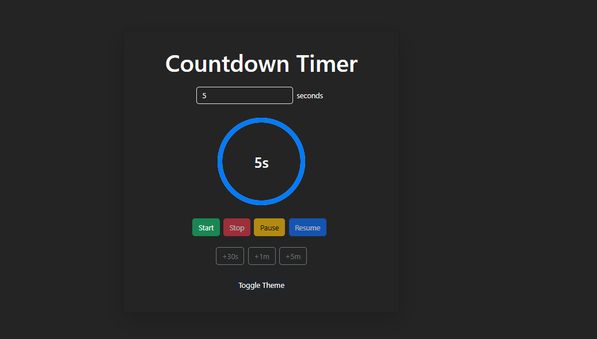

# Countdown Timer App with Theme Toggle and Bell Sound

This project is a simple and interactive countdown timer built using React. It features customizable countdown duration, a bell sound upon completion, and a light/dark theme toggle.

## Features
- ⏰ Countdown Timer with Start, Stop, Pause, and Resume functionalities
- 🔔 Bell sound upon countdown completion (with a button to stop the sound)
- 🌙 Light/Dark Theme Toggle
- 📱 Fully responsive design using Bootstrap


## Getting Started
### 1. Fork the Repository
To get started, fork this repository to your GitHub account by clicking the Fork button on the top right of this page.


## Project Setup

### 1. Clone the Repository
After forking, clone the project to your local system:

```bash
git clone https://github.com/quraishytalhazubaer/Countdown-timer.git
cd Countdown-timer
```

### 2. Install Bootstrap
To style the project with Bootstrap, install it using:

```bash
npm install bootstrap
```

### 3. Start the Development Server
Run the following command to launch the project:

```bash
npm start
Project Structure
```

```bash
countdown-timer/
├── public/
├── src/
│   ├── App.js
│   ├── index.css
│   ├── index.js
└── package.json
```

## Usage Instructions
- Open your browser at http://localhost:3000
- Set your desired countdown duration using the input field.
- Control the timer using the buttons:
  1. **Start**: Begins the countdown.
  2. **Pause**: Temporarily halts the countdown.
  3. **Resume**: Continues the countdown.
  4. **Stop**: Stops and resets the timer.
  5. Enjoy a bell sound at the end of the countdown (with an option to manually stop it).
  6. Use the theme toggle button to switch between light and dark modes.

## Commands Summary
| Command	              | Purpose                        |
|-----------------------|--------------------------------|
| npx create-react-app	| Create a new React project     |
| npm install bootstrap	| Install Bootstrap for styling  |
| npm start	            | Start the development server   |


## Deploying the Application
To deploy your app, run:
```bash
npm run build
```
## Future Improvements
- 🔧 Customizable alert sounds
- 💡 Custom themes

## Contributing
If you'd like to contribute, please fork the repository and submit a pull request.

## Interface

